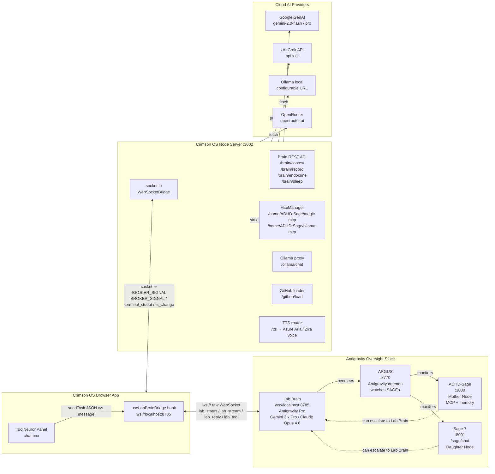

# Crimson OS — Architecture & Data-Flow Diagram

> Generated 2026-07-07 via manual source analysis (projscan CLI unavailable — Bash execution blocked).
> Sources read: App.tsx, aiService.ts, useAiOrchestrator.ts, messageBroker.ts,
> patternInjectionService.ts, ingestionService.ts, filteringService.ts,
> identityInjection.ts, useBrain.ts, usePipeline.ts, useWebSockets.ts,
> WebSocketBridge.ts, useLabBrainBridge.ts, useSwarm.ts, useLabController.ts,
> brain/types.ts.

---

## Legend

| Symbol | Meaning |
|--------|---------|
| `[Hook]` | React hook (client-side state machine) |
| `[Service]` | Pure TS service / singleton |
| `[Panel]` | Rendered React panel component |
| `[Ext]` | External process / remote service |
| `broker` | Singleton `MessageBroker` pub/sub bus (in-process) |
| `SIGNAL_*` | Named event topics on the broker |
| `ws://` | Raw WebSocket (not socket.io) |
| `socket.io` | socket.io transport (browser ↔ Crimson server) |

---

## Diagram 1 — Full User-Input → AI-Response Data Flow

```mermaid
flowchart TD
    %% ── User Entry ─────────────────────────────────────────────────
    USER([User Input]) --> ROUTER{activeTab}

    ROUTER -->|toolneuron| TN[ToolNeuronPanel\n+ chat box]
    ROUTER -->|editor| ED[EditorPanel\n+ assistant sidebar]
    ROUTER -->|terminal| TERM[TerminalPanel\n+ AI command layer]
    ROUTER -->|tools| TOOLS[ToolsPanel\n+ project mgmt]

    %% ── Tab → Hook wiring ─────────────────────────────────────────
    TN -->|lab.handleSubmit| LC[useLabController\nhook]
    ED -->|chatState.handleEditorAssistantSubmit| CH[useChatHandlers\nhook]
    ED -->|lab.triggerCommand| LC
    TERM -->|terminalState.handleTerminalCommand| TL[useTerminalLogic\nhook]

    %% ── Brain context fetch (parallel, before AI call) ───────────
    LC -->|prepareContext POST /brain/context| BRAIN_API[Brain API\n:3002/brain/*]
    CH -->|prepareContext POST /brain/context| BRAIN_API
    BRAIN_API -->|BrainContext {stm, ltm, endocrine}| LC
    BRAIN_API -->|BrainContext| CH

    %% ── Pipeline dispatch ─────────────────────────────────────────
    LC -->|pipeline.dispatch SIGNAL_RAW| INGEST
    CH -->|pipeline.dispatch SIGNAL_RAW| INGEST
    TL -->|orchestrator.generateAIResponse direct| ORCH

    %% ── Stage 1 Ingestion ─────────────────────────────────────────
    subgraph PIPELINE [Message Pipeline — 3 Stages]
        INGEST[ingestionService\nStage 1: validate + stamp ID]
        INGEST -->|broker.publish SIGNAL_INGESTED| FILTER

        FILTER[filteringService\nStage 2: rate-limit · dedup · sanitize\nmax 8/s · 300 ms dedup · 64 KB cap]
        FILTER -->|broker.publish SIGNAL_FILTERED| INJECT
        FILTER -->|broker.publish SIGNAL_DROPPED| DLQ[(DLQ)]

        INJECT[PatternInjectionService\nStage 3: pattern-match → route]
        INJECT -->|injectIdentity on every signal.data.system| IDLAYER
        IDLAYER[identityInjection.ts\nSAGE_SUBSTRATE_OVERRIDE prefix\n+ Neuro-Constants block]
        IDLAYER --> INJECT
    end

    %% ── Orchestrator ──────────────────────────────────────────────
    INJECT -->|broker.publish AI_REQUEST_QUEUED| ORCH
    ORCH[useAiOrchestrator\nmulti-worker dispatch]

    %% ── Brain context woven into system prompt ────────────────────
    ORCH -->|formatNeuralContext inject STM + endocrine| SYS_PROMPT[Enriched System Prompt\n= SAGE override\n+ Neuro-Constants\n+ dopamine / cortisol\n+ STM recent memory\n+ LTM relevant experiences]

    %% ── Worker fan-out ────────────────────────────────────────────
    ORCH -->|single worker| W1
    ORCH -->|multi-worker Promise.allSettled → first winner| W1 & W2 & WN

    subgraph WORKERS [AI Worker Pool — configurable]
        W1[Worker 1\nprovider + model]
        W2[Worker 2\nprovider + model]
        WN[Worker N\n...]
    end

    %% ── Provider routing (generateAIResponse switch) ──────────────
    W1 -->|aiProvider switch| PROV_ROUTE{provider?}
    PROV_ROUTE -->|google| GOOGLE[Google GenAI SDK\ngemini-2.0-flash / pro]
    PROV_ROUTE -->|grok| GROK[xAI Grok API\nhttps://api.x.ai]
    PROV_ROUTE -->|ollama| OLLAMA_PROXY[Server proxy\n/ollama/chat → Ollama local]
    PROV_ROUTE -->|openrouter| OR[OpenRouter API\nhttps://openrouter.ai]

    %% ── Response path ─────────────────────────────────────────────
    GOOGLE & GROK & OLLAMA_PROXY & OR -->|text response| AI_RESP
    AI_RESP[AI Response text]
    AI_RESP -->|broker.publish LLM_NETWORK_TRAFFIC latency| BROKER_BUS[(MessageBroker\nsingleton bus)]
    AI_RESP -->|broker.publish AI_RESPONSE_RECEIVED PatternResult| BROKER_BUS

    %% ── Response surfaces back to UI ──────────────────────────────
    BROKER_BUS -->|pipeline.onResponse handler| LC
    LC -->|setChatMessages append| TN
    LC -->|recordInteraction POST /brain/record| BRAIN_API

    %% ── Broker → WebSocket bridge (server-side) ───────────────────
    BROKER_BUS -->|WebSocketBridge broker.subscribe * → io.emit BROKER_SIGNAL| WS_SRV[socket.io server\n:3002]
    WS_SRV -->|BROKER_SIGNAL| WS_CLIENT[useWebSockets hook\nbrowser socket.io client]
    WS_CLIENT -->|lastWsSignal| BRAIN_HOOK[useBrain hook\nLTM/STM/endocrine sync]
    WS_CLIENT -->|terminal_stdout/stderr| TL

    %% ── Swarm path ────────────────────────────────────────────────
    TN -->|swarm.runCycle| SWARM[useSwarm\nrunSwarmCycle]
    SWARM -->|generateAIResponse per agent| ORCH
    SWARM -->|broker.publish SWARM_CYCLE_START / SWARM_CONSENSUS| BROKER_BUS

    %% ── Phi stabilisation inside PatternInjectionService ─────────
    INJECT -.->|phiStabilise confidence on swarm signals\nPHI_INV=0.618 primary / PHI_MIN=0.382 minority| BROKER_BUS
```

---

## Diagram 2 — External Service Connections (3-Tier Oversight Stack)



---

## Top Coupled Files (Import-Count Proxy — manual analysis)

> Note: projscan CLI could not be executed (Bash node permission required).
> The table below is derived from direct import-count analysis of source files.
> Import count = number of `import` statements in the file (fan-in proxy).

| Rank | File | Import Count | Role / Why So Coupled |
|------|------|-------------|----------------------|
| 1 | `src/App.tsx` | 50 | Root composition: owns all hooks, all panel routes, all state |
| 2 | `src/hooks/useLabController.ts` | ~15 | Command dispatcher: receives lab commands and fans out to 10+ handlers |
| 3 | `src/services/aiService.ts` | 5 | Central AI call hub: imports broker, identity, brain types, Google SDK |
| 4 | `src/hooks/useAiOrchestrator.ts` | 6 | Worker fan-out: imports aiService + agentRegistry + WorkerConfig |
| 5 | `src/hooks/usePipeline.ts` | 5 | Pipeline bootstrap: wires all 3 stages + broker subscriptions |
| 6 | `src/services/pipeline/patternInjectionService.ts` | 3 | Stage 3: imports broker + identityInjection + defines PatternResult |
| 7 | `src/services/pipeline/filteringService.ts` | 1 | Stage 2: only needs broker (self-contained rate/dedup logic) |
| 8 | `src/services/pipeline/ingestionService.ts` | 1 | Stage 1: only needs broker (validate + stamp) |
| 9 | `src/services/messageBroker.ts` | 0 | Zero dependencies — pure pub/sub primitive; everything else imports it |
| 10 | `src/hooks/useBrain.ts` | 3 | Neural state: brain/types + apiUrl + React; feeds brainContext to AI |
| 11 | `src/services/identity/identityInjection.ts` | 1 | Imports types.ts constants only; called by aiService + patternInjection |
| 12 | `src/hooks/useSwarm.ts` | 4 | Swarm orchestration: swarmEngine + types + useSwarmState |
| 13 | `src/services/bridge/WebSocketBridge.ts` | 4 | Server-side relay: broker → socket.io → client |
| 14 | `src/hooks/useWebSockets.ts` | 2 | Client socket.io: connects to server bridge, surfaces lastSignal |
| 15 | `src/hooks/useLabBrainBridge.ts` | 1 | Raw WS bridge to Lab Brain daemon :8785 |
| 16 | `src/hooks/useChatHandlers.ts` | ~8 | Editor assistant + doc apply + prompt building |
| 17 | `src/services/swarm/swarmEngine.ts` | ~4 | φ-weighted consensus engine, runs per-agent AI calls |
| 18 | `src/hooks/usePersonalities.ts` | ~3 | Personality slot management, API key state |
| 19 | `src/hooks/useAiWorkers.ts` | ~3 | Worker config state, Ollama model polling |
| 20 | `src/services/brain/types.ts` | 0 | Pure type definitions — imported by 5+ files, no own deps |

---

## Key Architectural Notes

### Longest Call Chain (chat message → AI response)

```
User types in ToolNeuronPanel
  → lab.handleSubmit (useLabController)
    → prepareContext() POST /brain/context  [parallel fetch]
    → pipeline.dispatch(SIGNAL_RAW, 'chat', data)
      → ingestionService.ingest()           [Stage 1: validate + ID stamp]
        → broker.publish(SIGNAL_INGESTED)
          → filteringService.onIngested()   [Stage 2: rate · dedup · sanitize]
            → broker.publish(SIGNAL_FILTERED)
              → patternInjectionService.onFiltered()
                → injectIdentity(signal.data.system)  [SAGE substrate override]
                → broker.publish(AI_REQUEST_QUEUED)
                → pattern.handler(injectedSignal, executor)
                  → withRetry(() => executor(prompt, system))
                    → useAiOrchestrator.generateAIResponse()
                      → formatNeuralContext(brainContext) [inject STM/endocrine]
                      → injectIdentity(systemInstruction) [second enforcement]
                      → Promise.allSettled(workers.map → generateAIResponseService())
                        → aiService.generateAIResponse()
                          → switch(aiProvider) → Google/Grok/Ollama/OpenRouter
                          → Promise.race([providerCall, timeoutAt120s])
                          → broker.publish(LLM_NETWORK_TRAFFIC)
                → broker.publish(AI_RESPONSE_RECEIVED, PatternResult)
                  → pipeline.onResponse handler
                    → setChatMessages([...prev, aiMessage])
                    → recordInteraction() POST /brain/record
```

**Depth: ~13 async hops.** The bottleneck is `patternInjectionService.onFiltered()` — it is the single chokepoint that serialises every signal through the broker, applies identity injection, dispatches to the worker pool, and re-publishes the result. All circuit breakers, retries (max 3, exponential backoff from 400ms), and DLQ logic live here. A handler failure trips the circuit after 3 consecutive errors and suppresses that handler for 15 seconds.

### Identity Injection — Double Enforcement

`injectIdentity()` is applied **twice** on every chat message:
1. In `patternInjectionService.injectSystemIdentity()` — at the signal level before the pattern handler runs.
2. In `aiService.generateGoogleResponse()` (and per-provider equivalents) — at the provider call level.

The function is idempotent (checks for `### [SAGE_SUBSTRATE_OVERRIDE]` prefix), so double-injection is safe but intentional — closing any code path that bypasses the pipeline.

### Brain Context Loop

`useBrain` is passive (no push subscription to broker). It polls `/brain/endocrine` on mount and on `NEURAL_STATE_UPDATE` WebSocket signals from the server. The `prepareContext()` call (POST `/brain/context`) is the hot path — it runs before every AI request that goes through `useLabController` or `useChatHandlers`, returning STM (recent working memory) + LTM (relevant past experiences via embedding match) + live endocrine state. This context is injected into the system prompt via `formatNeuralContext()` inside each provider function.
